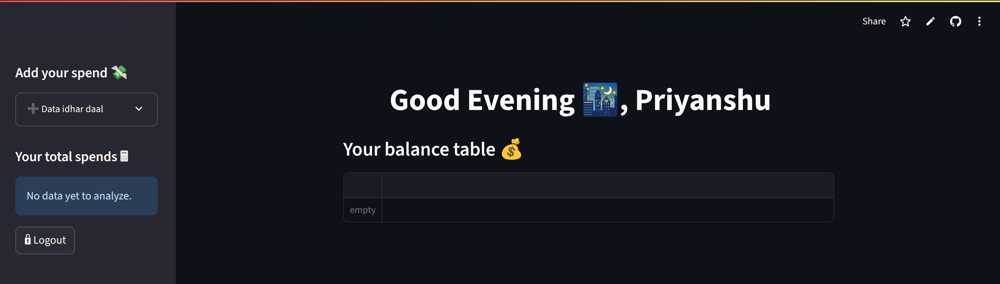
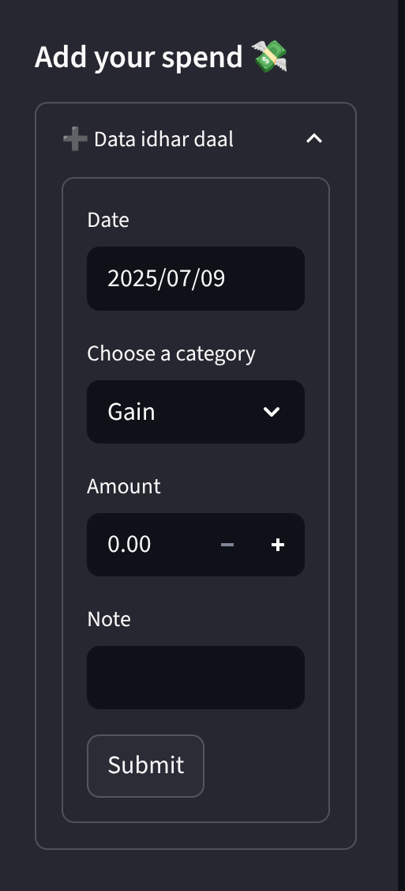

# Daily spend tracker app
## 💸 PocketFlow - Your Daily Expense Tracker (Live App)

[](https://pocketflow.streamlit.app/)
[](https://www.python.org/)
[](https://opensource.org/licenses/MIT)

PocketFlow is a minimalist, real-time **personal spend tracker** built using **Streamlit**, backed by **Google Sheets**, and powered with **Gmail automation** to send you monthly spend reports — all in a sleek, secure, and mobile-friendly UI.

🧠 Made with ❤️ by [Priyanshu](https://github.com/yansh07)

---

## 🚀 Live Demo

🔗 [pocketflow.streamlit.app](https://pocketflow.streamlit.app/) — click, log in, and start tracking your life.

---

## 📦 Features

✅ Add daily expenses with **category, note & amount**  
✅ View full spend history in **Google Sheets**  
✅ Auto-calculated **total gains, losses, and borrowed amounts**  
✅ One-click **CSV export + email** every month  
✅ Built-in **login security phrase** (basic auth)  
✅ Clean **Streamlit UI** and mobile responsiveness

---

## 📸 Screenshots

| Dashboard | Sidebar Form | Monthly Report |
|----------|--------------|----------------|
|  |  |  |


---

## ⚙️ Tech Stack

| Tool | Usage |
|------|-------|
| 🐍 Python | Core language |
| 📊 Streamlit | Web UI |
| 📁 Google Sheets (via GSpread) | Realtime backend database |
| ✉️ Gmail SMTP | Sending monthly reports |
| 📄 Pandas | CSV generation |
| 🧪 dotenv + secrets.toml | Auth & credentials mgmt |
| 🔐 Streamlit Secrets | Safe cloud deployment without pushing sensitive files |

---

## 🛠️ Setup Instructions (Locally)

1. **Clone this repo**  
   ```bash
   git clone https://github.com/yansh07/spend-tracker.git
   cd spend-tracker
2. **Create and activate virtualenv**
   ```bash
   python -m venv venv
   source venv/bin/activate
3. **Install dependencies**
   ```bash
   pip install -r requirements.txt
4. **Setup environment**  
   -> Add your gcp_service_account.json file for local testing  
   -> Or set it in .streamlit/secrets.toml for cloud
5. **Run the app**
   ```bash
   streamlit run app.py
     
### 📬 Monthly Report Format
Every month-end, PocketFlow sends:

🧾 Subject: "Your Monthly Spend Report 📜"  
📎 Attachment: spends.csv  
🧠 Message: "Attached is your full monthly expense report 🥲. Now cry accordingly."  

*(Yes. We're keeping it real.)*    

### 🧠 Future Plans
**-> Add Google Sign-in**  
**-> Expense trends with charts**  
**-> Export to Excel**  
**-> Light/Dark mode toggle**  

## 📜 License  
MIT — use it, modify it, share it freely.  

### 🙏 Credits
**Google Sheets API**  
**Streamlit community**  
**ChatGPT for guidance & rubber-duck debugging 🦆**
